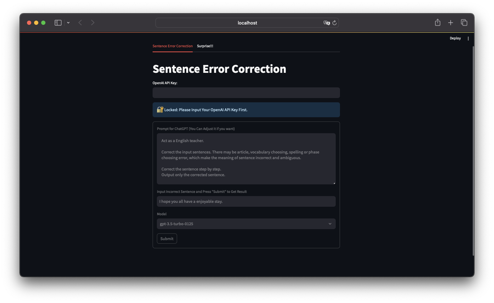
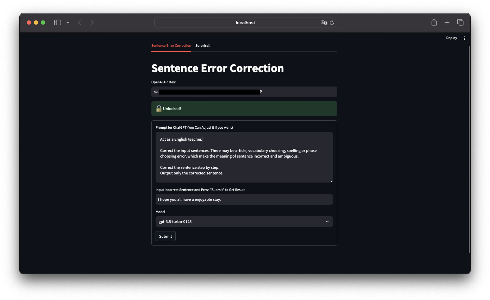
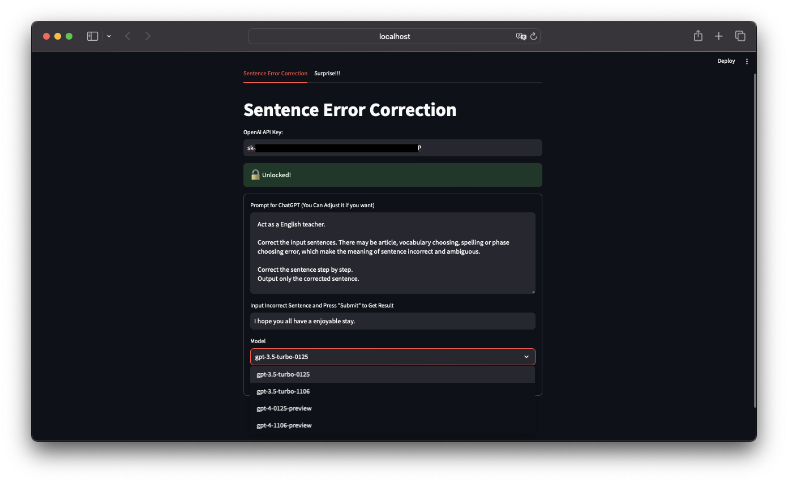
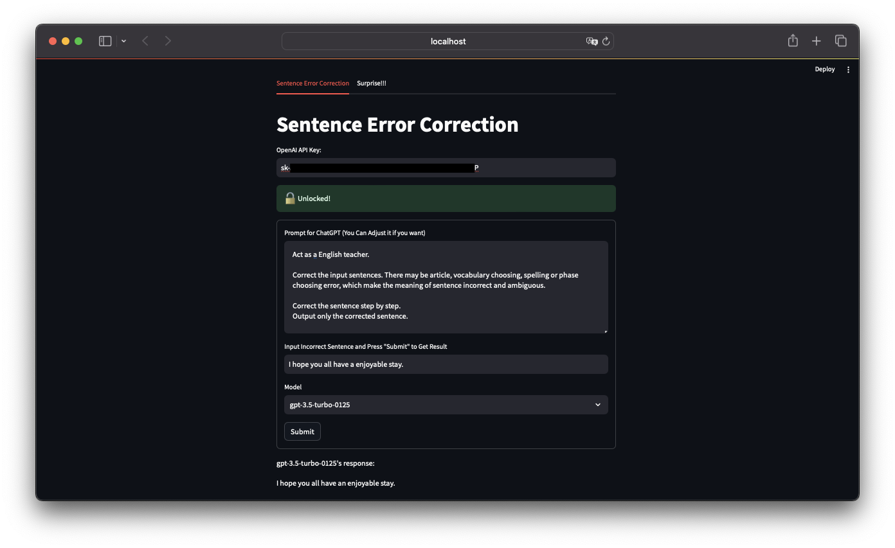

# Sentence Error Correction

In this project, utilizing Python and OpenAI API to develop a Streamlit web focused on correcting sentence error.

## Features

### Usage

1. The website's session state is **locked** without an **OpenAI API Key**.   
You can apply an OpenAI API Key on [OpenAI](https://openai.com/blog/openai-api).

   

2. After inputing a key, the session will be **unlock**. 
You can input **sentence that you want to correct** now.  
(Hint: you can adjust the **prompt** by yourself if you would like to. Try it now!)

   

3. You may also change the OpenAI model. The default model is **gpt-3.5-turbo-0125**
    
    

4. Click the **"Submit"** button, you will get the corrected sentence in couple seconds.

   

### Python Module Required & Version

- openai: 0.28.0 
- streamlit: 1.28.2
- streamlit-lottie: 0.0.5

### How I Design the Prompt

- Assuming Roles
- Assign Tasks and Details
- Chain of Thought Prompts
- Specify Output Format
- Provide Few Shots Examples

## Resources
